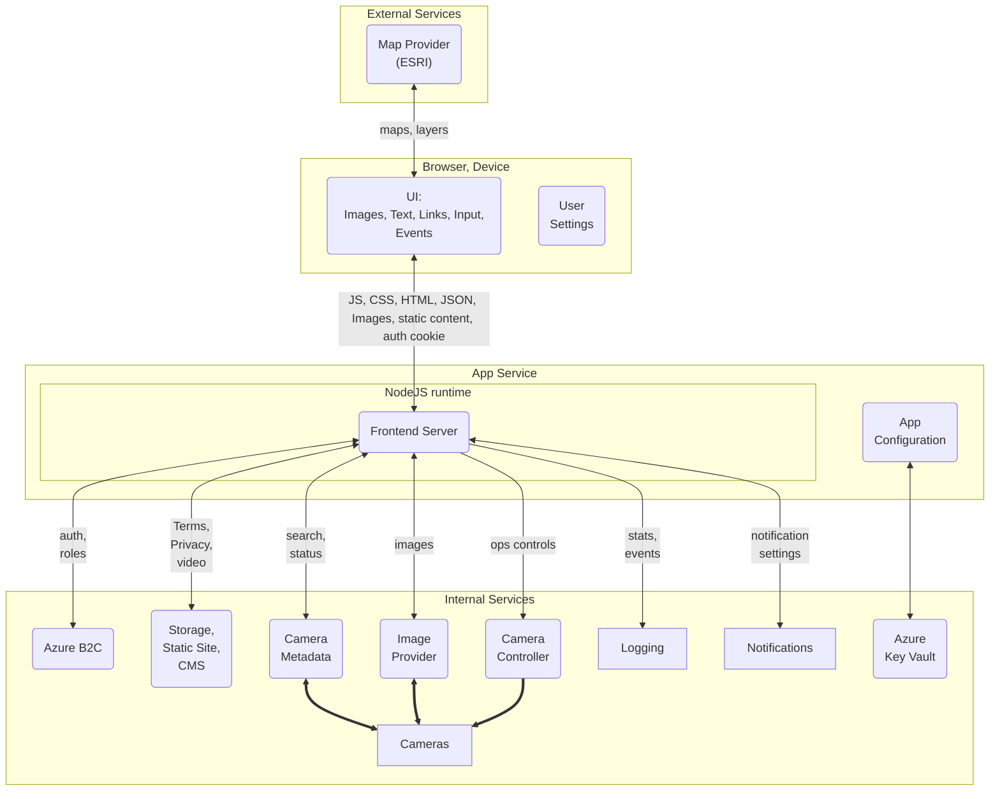

## ALERTCalifornia Frontend Architecture

* Frontend Server (Node.js in a container) provides assets to the UI and accesses services from a server context, without exposing service secrets or endpoints directly to clients. It can be scaled with multiple instances.
* Frontend Server provides API endpoints for the UI that can be implemented with sample data & services for automated testing, remote/local development outside of cloud environemnt, and mock services for early development before actual services are implemented.
* Separating client & server concerns on the frontend allows for build-time optimization, secure runtime configuration of the server features via App Config & Key Vault, and hides secrets (e.g. ESRI API key, internal service endpoints) from the end-user.
* User Settings in browser includes search preferences, selected location, UI theme, and other client-specific options that don't require database persistence across devices.
* Storage: a Camera Metadata database to place each camera plus status and ops access, Notifications database to set/view/reset user's notification requests for selected areas, Images over time for each camera, Logging of events (login, camera operations), Static content (links, text, videos).
* Caching: 
  * browser: each downloaded image saved in browser cache, using static URLs, returns with HTTP 304.
  * backend for frontend (BFF) instance: camera metadata & layer definitions cached & refreshed here.
  * CDN: static content, e.g. Terms of Use, Privacy policy, How To video(s). On 
  * map and layers: served by ESRI/ArcGIS and however it uses the browser.
* Security: route guards to distinguish access for public vs. authenticated users.
* Risk: exposing the ESRI API key(s) to the browser may allow hackers to use our access in a DDOS attack on ESRI and the AlertCA app and/or cause extra costs in AlertCA's use of ESRI.
* Risk: exposing direct access to camera APIs may cause bandwidth issues.
* Risk: overuse bandwidth with parallel query of cameras during development and production. Mitigation: systematically throttle access to active cameras (moved in 3 hours) during development.
* Opportunity to measure API resource & bandwidth constraints & query-frequency constraints on cameras.
